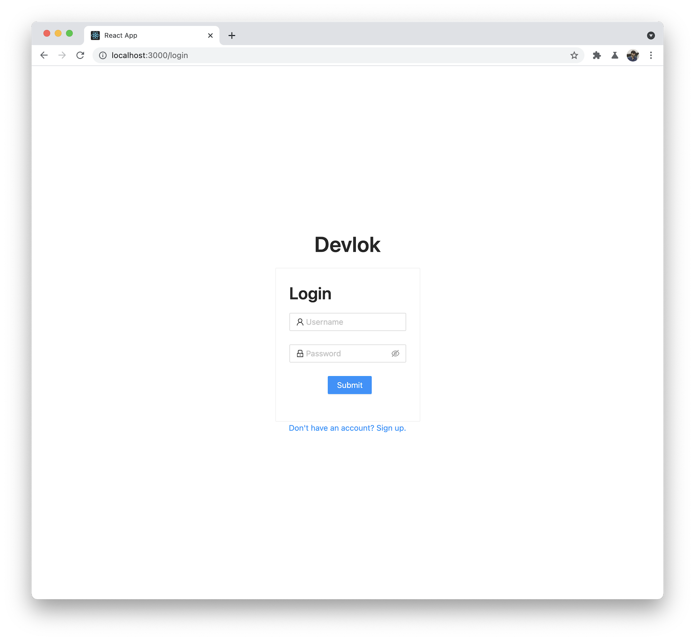
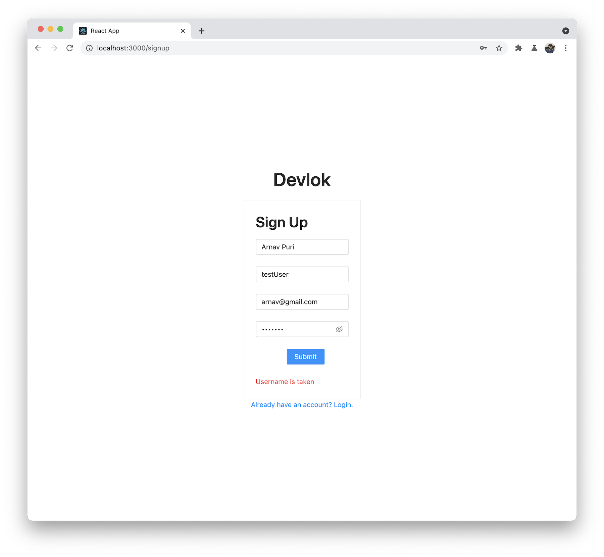
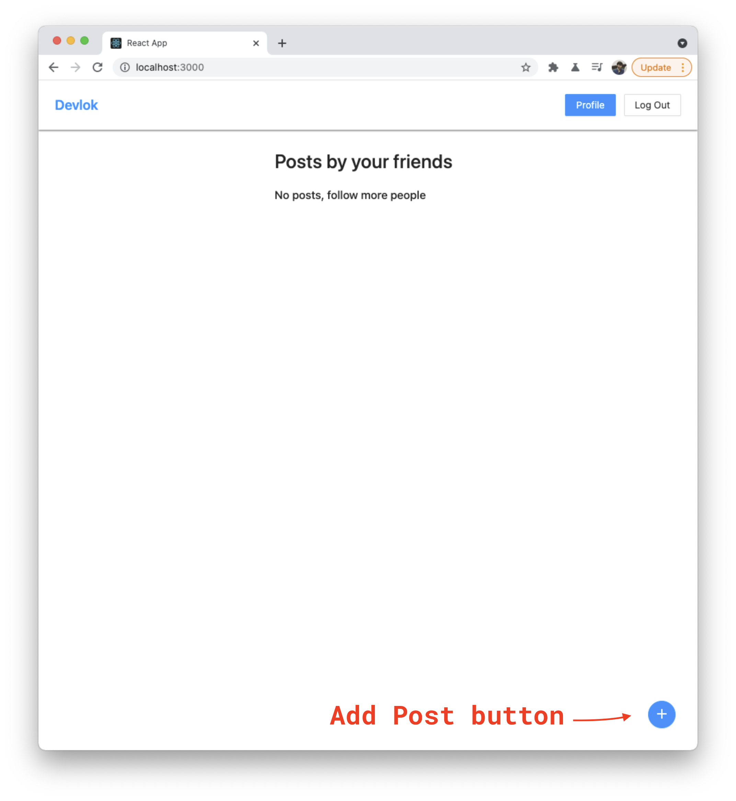
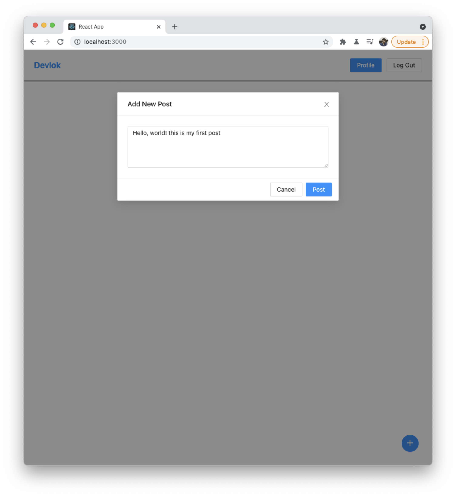
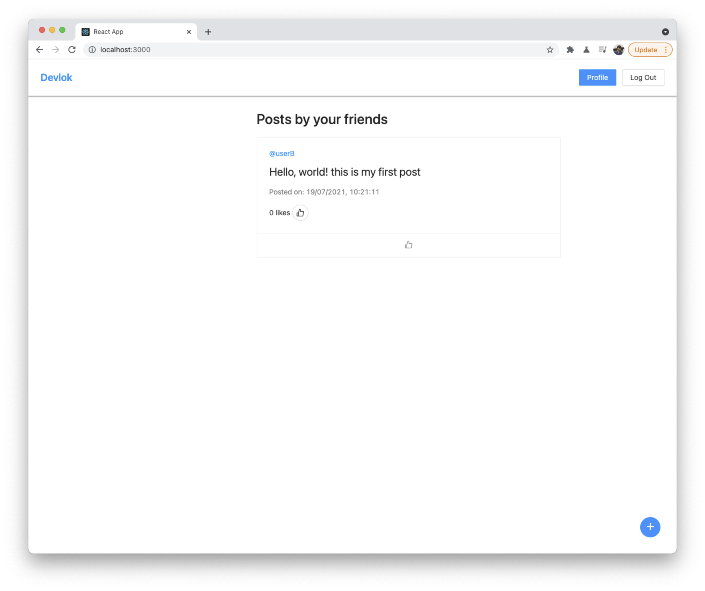
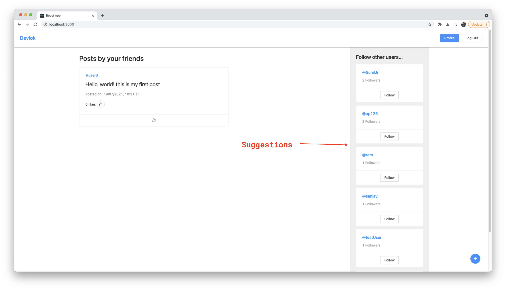

# Capstone 2 - Programmer's Social Media

# Before you start
- We want you to include two `README.md` files, one for Backend and one for Frontend
    - The backend file should have information about the endpoints (with request type) and parameters that each endpoint accepts.  
    - Backend should also mention any headers expected for any endpoint. You should be writing the Readme file for other developers who might use your backend code.
    - For Frontend, mention how to build the project, and deployment instructions
    - Mention the features of the frontend and include the screenshots of the screens as well.
     
- We want you to keep track of time in a `Timesheet.md` file. You can have this file in root of `Backend`, here is a sample entry in the time sheet file.
```
### Part 1
    19 Jul '21 
    13:53 - 14:35: Working on the login and signup API 
    15:00 - 17:00: Working on the login and signup API
    --------------
    20 Jul '21
    09:30 - 09:48: Working on the frontend for Signup and Login 
    09:57 - 10:50: Working on the frontend for Signup and Login

Part 1 completed in around 3 hours 30mins.

### MISC
23 Jul '21
11.30 - 13.00: Fixed some bugs and UI issues as per the feedback
```

# Social Media Website
We will be building a Full Stack social media website. The development of the Frontend and Backend will go hand in hand.
The project is divided into multiple `Milestones` (you get paid for each milestone in a real project) and sub modules called `Parts` (will be created by you for smooth development).

On this platform an user can signup by choosing unique username and providing their email id. After creation of profile they can login and see their `feed`. They can add a new post, like existing post, follow new people (or un-follow). They can also visit anyone's profile and see all the information about that user like their username, name, posts by them, their followers and following count.

If they are not following anyone they will see an empty feed. We will show 5 users which the logged-in user is not following on the right sidebar so an user can follow.

Ok let's begin the project, you are free to choose any name you want. 

### Tech Stack 
- Backend
    - NodeJS
    - ExpressJS
    - MongoDB
    - JWT for authorization
- Frontend
    - React
    - ChakraUI

You are free to use any other library that you want to use, just mention it in the respective Readme file.
    

## Milestone 1: Authentication
---
## Part 1: Auth Backend
- We will be using the `JWTs` for authorization purpose.
- User can create an account with username (should be unique), email (should be unique), password and profile picture (optional)
- User logs in with username and password and receives access token and refresh token, if successful.
- User can logout, which will invalidate their refresh token.

## Part 2: Application Frontend
Use ChakraUI library to create Login and Sign-up pages 

The design can differ as the screenshots were taken using a differetn UI library but the layout should remain the same.




You also need to add `Upload` profile picture button here.
 
Make sure you display errors for all scenarios like:
- Username already taken
- Incorrect username/password
- Email already taken
 
All the fields in the forms are required except the profile picture.
 
If login is successful redirect the user to `/feed`.

## Milestone 2: User Feed
---
## Part 3 - Backend: Create post
- Add endpoints in your project to handle 
  - Post creation
  - Post detail which will include, list of people who have liked the post.
  - Deleting a Post

## Part 4 - Frontend: Add new Post
You can start building the layout of the feed which will be empty initially. Add a floating fixed button on the bottom right.



After clicking on the button show the popup to add the post.




If the post creation is successful it should be added to the feed.


## Part 5 - Backend: Follow Users and suggestion list
- Create endpoints to follow/un-follow any user from the list of registered users. (by username)
- Create an endpoint to fetch the list of users a logged-in user can follow.

## Part 6 - Frontend: Show the list of Users to follow and Follow button


